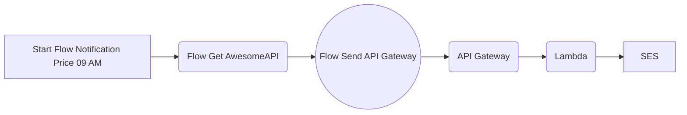

# Documentação do Sistema de Notificação de Cotação do  Dólar

Este sistema tem como objetivo enviar **notificações** por email informando a cotação atual do dólar em relação ao real. O start do processo é acionado por um fluxo no **Apache NiFi** que está hospedado em uma instância **AWS EC2(Elastic Compute Cloud) **, este fluxo é responsável por requisitar a cotação atual do dólar através da API de cotações de moedas da **AwesomeAPI**, retornado a response da API contendo a cotação nós iremos enviar o payload para o **API Gateway** que está configurado para acionar uma função lambda que é responsável por receber, tratar e enviar um email através do serviço **AWS SES (Amazon Simple Email Service)**. Este fluxo no NiFi tem um cron que está configurado para disparar diariamente às 09h da manhã, dando assim start no fluxo.

## Arquitetura do Sistema

1.  O fluxo NiFi é hospedado em uma instância EC2 configurada com Ubuntu e é responsável por requisitar a cotação do dólar através de uma API de terceiros e enviar para o API Gateway.
    
3.  API Gateway(method post)se acionado dispara a função Lambda.
    
4.  A função Lambda processa o payload que contém a cotação e envia um email com a informação para um endereço específico, utilizando o serviço SES da AWS.

### Imagem Fluxo NiFi

### Visão geral da função

### Notificação recebida

